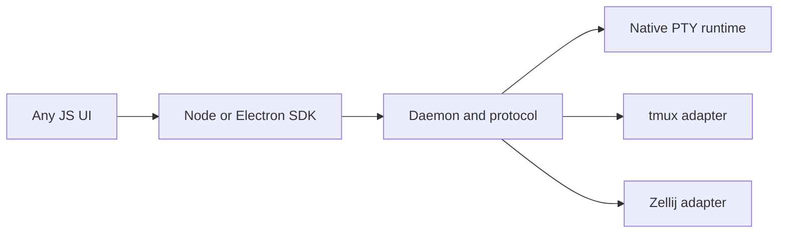

# Terminal Platform

Embeddable terminal platform for desktop apps, IDEs, and agent workspaces.

It is built around a Rust core with a daemon-first protocol, a native PTY runtime, and honest foreign adapters for `tmux` and `Zellij`. JavaScript and Electron are first-class consumers, but the UI layer is intentionally separate so the frontend can be written however you want.

## What You Can Build With It

- terminal-powered IDE features
- Electron apps with real terminal sessions
- AI or agent workspaces that need shells, panes, tabs, and session state
- standalone terminal products built on top of a reusable runtime layer
- host apps that need a Rust runtime plus a thin Node or C integration seam

## Why This Project Exists

Most terminal integrations break down in one of two ways:

- the terminal logic gets trapped inside one UI stack
- `tmux`, `Zellij`, and native PTY flows get flattened into fake parity

Terminal Platform is designed to avoid both.

- Rust owns runtime truth and lifecycle
- `NativeMux` is the canonical model
- `tmux` and `Zellij` are capability-gated adapters, not fake equals
- Node and Electron are leaf host surfaces, not the architectural center
- UI remains a separate layer above the runtime and transport

## Architecture In One Minute



The important design rule is simple:

- one semantic orchestration layer above
- one canonical runtime truth in the middle
- explicit capability truth below

## What Is Already Here

Current implemented surfaces include:

- native PTY runtime with session, tab, pane, topology, and screen flows
- imported backend support for `tmux`
- imported backend support for rich `Zellij 0.44+`
- ordered mutation lane for imported `Zellij` sessions
- daemon and local socket client transport
- typed Rust facade for host integrations
- Node and Electron SDK via `napi-rs`
- C ABI package for non-Node embedders
- persistence, smoke tests, fuzz targets, and hosted CI closeout lanes

## V1 Support Matrix

- `macOS + Linux` - `Native + tmux + Zellij`
- `Windows` - `Native + Zellij`
- `tmux` stays Unix-only in v1 docs, tests, CI, and acceptance

## Status

⚠️ The project is in **v1 release-candidate closeout**, not in the raw prototype stage.

That means:

- core runtime and host surfaces are implemented
- reliability and lifecycle hardening are already deep
- the current work is mostly final acceptance, hosted CI proof, and release polish

If you are evaluating the repo, the honest takeaway is:

- this is already a serious architecture and codebase
- it is not yet presented as a finished stable public release
- the remaining gap is mostly proof and packaging polish, not missing core design

Release closeout artifacts:

- [v1 manual closeout runbook](./docs/terminal/v1-manual-closeout-runbook.md)
- [v1 release candidate summary](./docs/terminal/v1-release-candidate-summary.md)
- [v1 release candidate checklist](./docs/terminal/v1-release-candidate-checklist.md)

## Who This Is For

This repository is a good fit if you want:

- a reusable terminal runtime, not just a terminal widget
- a terminal layer for Electron without pushing terminal truth into JS
- support for both native PTY and imported multiplexer workflows
- a foundation for products like IDEs, coding tools, developer workspaces, or agent shells

This repository is not trying to be:

- a fake one-size-fits-all terminal backend
- a frontend component library
- a promise that `tmux`, `Zellij`, and native all behave identically

## Quick Start

Clone the repository, then run the main workspace gates:

```bash
cargo fmt --all --check
cargo clippy --workspace --all-targets --all-features
cargo nextest run --workspace
```

For the v1 readiness audit:

```bash
cargo run -p xtask -- verify-v1-readiness
```

## Backend Modularity

`terminal-daemon` now supports honest compile-time and config-time backend composition.

Compile only the backend families you want:

```bash
cargo test -p terminal-daemon --no-default-features --features native-backend
cargo test -p terminal-daemon --no-default-features --features tmux-backend
cargo test -p terminal-daemon --no-default-features --features zellij-backend
```

Or keep the default full bundle and disable specific compiled backends at runtime:

```rust
use terminal_daemon::{TerminalDaemonBackendConfig, TerminalDaemonState};
use terminal_domain::BackendKind;

let state = TerminalDaemonState::with_backend_config(
    TerminalDaemonBackendConfig::default()
        .enable(BackendKind::Tmux, false)
        .enable(BackendKind::Zellij, false),
) ?;
```

The daemon handshake will report only the backends that are actually compiled and enabled. Unsupported combinations fail explicitly instead of silently degrading into fake parity.

## Main Surfaces

### Rust Core

The Rust workspace owns:

- domain and mux models
- backend APIs and adapters
- daemon transport
- persistence and projections
- test harnesses and reliability gates

### Node And Electron

`terminal-node` owns the stable Rust facade for Node-facing consumers.

`terminal-node-napi` owns the Node and Electron leaf surface:

- native addon via `napi-rs`
- CJS and ESM entrypoints
- typed declarations
- package staging and install smoke
- Electron main and preload bridge helpers
- session and screen subscription helpers

### C ABI

`terminal-capi` is the non-Node embedding seam.

It includes:

- opaque client handles
- JSON request and reply functions
- explicit subscription handles
- generated headers through `cbindgen`
- staged and installed package verification

## Quality And Reliability

The repository is not relying on happy-path demos only.

Quality gates currently include:

- `cargo fmt`
- `cargo clippy`
- `cargo nextest`
- a vendored Windows `portable-pty` guardrail that pins `CreatePseudoConsole(..., 0, ...)` until broader flag behavior is proven in hosted CI
- fuzz baseline runs under `fuzz/`
- staged and installed package smoke for Node
- staged and installed package smoke for the C ABI
- Electron lifecycle smoke
- restart, shutdown, stale-daemon, and backpressure regression coverage

Manual acceptance capture also lives in:

- [`crates/terminal-testing/manual/`](./crates/terminal-testing/manual/)
- [`crates/terminal-testing/manual/runs/`](./crates/terminal-testing/manual/runs/)

## Repository Map

If you are new to the repo, these are the most important areas:

- `crates/terminal-backend-native` - native PTY runtime
- `crates/terminal-backend-tmux` - `tmux` adapter
- `crates/terminal-backend-zellij` - `Zellij` adapter
- `crates/terminal-daemon` - daemon host process
- `crates/terminal-daemon-client` - transport client
- `crates/terminal-node` - Rust host facade for Node consumers
- `crates/terminal-node-napi` - Node and Electron package layer
- `crates/terminal-capi` - C ABI host surface
- `crates/terminal-testing` - smoke, acceptance, and harnesses
- `docs/terminal/` - architecture, roadmap, and verification docs

## Documentation

Recommended reading order:

1. [`docs/terminal/start-here-v1-implementation-pack.md`](./docs/terminal/start-here-v1-implementation-pack.md)
2. [`docs/terminal/final-v1-blueprint-rust-terminal-platform.md`](./docs/terminal/final-v1-blueprint-rust-terminal-platform.md)
3. [`docs/terminal/v1-workspace-bootstrap-spec.md`](./docs/terminal/v1-workspace-bootstrap-spec.md)
4. [`docs/terminal/v1-implementation-roadmap-and-task-breakdown.md`](./docs/terminal/v1-implementation-roadmap-and-task-breakdown.md)
5. [`docs/terminal/v1-verification-and-acceptance-plan.md`](./docs/terminal/v1-verification-and-acceptance-plan.md)
6. [`docs/terminal/v1-release-candidate-checklist.md`](./docs/terminal/v1-release-candidate-checklist.md)
7. [`docs/terminal/v1-release-summary-template.md`](./docs/terminal/v1-release-summary-template.md)

## Node Package

The Node and Electron package README lives here:

- [`crates/terminal-node-napi/package/README.md`](./crates/terminal-node-napi/package/README.md)

## Current Repo URL

- [github.com/777genius/terminal-platform](https://github.com/777genius/terminal-platform)
