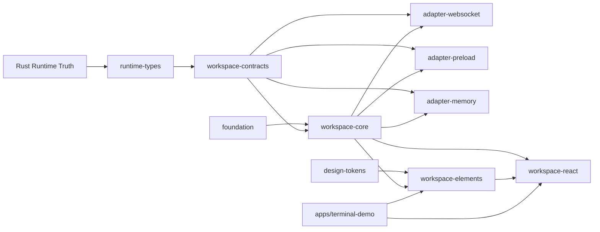

# UI SDK Execution Plan

**Checked**: 2026-04-22  
**Status**: frozen execution plan

## Goal

Build a long-lived, independent UI SDK product unit under `sdk/` that:

- consumes Rust terminal truth instead of redefining it
- supports multiple host surfaces without rewriting core logic
- ships a portable Web Components UI layer
- keeps React as an optional convenience layer
- can outlive and outscale `apps/terminal-demo`

## Product Boundary

The UI SDK includes:

- generated runtime-facing types
- stable public contracts
- headless orchestration and state
- transport adapters
- portable UI elements
- optional React wrappers
- testing harnesses and policy docs

The UI SDK does not include:

- canonical runtime truth
- daemon composition
- backend implementations
- Node leaf bindings as architectural center
- demo app logic as reusable source

## Frozen Architecture



## Absolute Rules

- `apps/terminal-demo` is consumer only
- Rust runtime and `NativeMux` remain the only canonical truth
- `runtime-types`, `workspace-contracts`, `workspace-core` read models, and element view state stay separate
- `workspace-core` does not import DOM, Lit, React, Electron, or WebSocket
- `workspace-elements` do not import `terminal-platform-node`
- transport adapters are the only anti-corruption boundary for external transport/runtime integration
- components do not own transport lifecycle
- raw transport DTOs do not leak into public component APIs
- public package APIs are closed through `exports`
- plugin boundary and host SDK boundary stay separate
- degraded semantics stay explicit in contracts and UI
- terminal content is treated as untrusted text data, not trusted HTML

## Target Repository Layout

```text
sdk/
  docs/
    adr/
    compatibility-matrix.md
    event-model.md
    theming-model.md
    release-policy.md
    support-policy.md
    migration-guide.md
  package.json
  tsconfig.base.json
  vitest.config.ts
  packages/
    foundation/
    runtime-types/
    design-tokens/
    workspace-contracts/
    workspace-core/
    workspace-adapter-websocket/
    workspace-adapter-preload/
    workspace-adapter-memory/
    workspace-elements/
    workspace-react/
    testing/
```

## Package Catalog

### `@terminal-platform/foundation`

Responsibilities:

- `ExternalStore`
- `ResourceScope`
- `Disposable`
- `AsyncLane`
- `GenerationToken`
- base errors
- telemetry sink

Not allowed:

- product business logic
- transport logic
- UI framework code

### `@terminal-platform/runtime-types`

Responsibilities:

- generated TypeScript mirror of Rust truth

Not allowed:

- UI read models
- transport envelopes
- React/Lit/DOM types

### `@terminal-platform/workspace-contracts`

Responsibilities:

- public IDs
- models
- ports
- commands
- observations
- public errors
- capability model
- compatibility metadata

Not allowed:

- concrete transport
- DOM/framework types

### `@terminal-platform/workspace-core`

Responsibilities:

- `WorkspaceKernel`
- services
- reducers
- selectors
- read models
- lifecycle ownership

Not allowed:

- DOM
- Lit
- React
- Electron
- WebSocket

### `@terminal-platform/workspace-adapter-*`

Responsibilities:

- codec
- normalization
- reconnect/retry
- subscription ownership

### `@terminal-platform/design-tokens`

Responsibilities:

- DTCG-compatible token source
- CSS variable generation
- typed theme manifests

### `@terminal-platform/workspace-elements`

Responsibilities:

- Lit custom elements
- Shadow DOM
- accessibility baseline
- renderer seam
- overlays
- slots and parts

Registration policy:

- self-define modules are allowed
- element classes are also exported
- a `defineTerminalPlatformElements()` helper is provided
- the global registry is the default v1 path
- the package is designed to be scoped-registry-ready later, not scoped-registry-first

### `@terminal-platform/workspace-react`

Responsibilities:

- wrappers
- hooks
- JSX typings
- typed event mapping

### `@terminal-platform/testing`

Responsibilities:

- fakes
- contract harnesses
- race and leak fixtures
- packed-consumer smoke helpers

## Primary Public API

```ts
export interface WorkspaceKernel {
  getSnapshot(): WorkspaceSnapshot
  subscribe(listener: () => void): () => void
  bootstrap(): Promise<void>
  dispose(): Promise<void>
  commands: WorkspaceCommands
  selectors: WorkspaceSelectors
  diagnostics: WorkspaceDiagnostics
}
```

## Public Package Naming

Package names are frozen as:

- `@terminal-platform/foundation`
- `@terminal-platform/runtime-types`
- `@terminal-platform/design-tokens`
- `@terminal-platform/workspace-contracts`
- `@terminal-platform/workspace-core`
- `@terminal-platform/workspace-adapter-websocket`
- `@terminal-platform/workspace-adapter-preload`
- `@terminal-platform/workspace-adapter-memory`
- `@terminal-platform/workspace-elements`
- `@terminal-platform/workspace-react`
- `@terminal-platform/testing`

## Element Tag Namespace

The public custom element namespace is frozen as:

- `tp-terminal-*`

Examples:

- `tp-terminal-workspace`
- `tp-terminal-session-list`
- `tp-terminal-toolbar`
- `tp-terminal-screen`

Shorter `tp-*` tags are rejected because collision risk is too high for a large public SDK.

## Core Internal Structure

The core exposes one facade outward and composes smaller internal services:

- `ConnectionService`
- `CatalogService`
- `CapabilitiesService`
- `ObservationService`
- `SessionCommandService`
- `SavedSessionsService`
- `DraftInputService`
- `DiagnosticsService`
- `ThemeResolutionService`

`GodController` is prohibited.

## Data Hierarchy

1. `runtime-types`
2. `workspace-contracts`
3. `workspace-core` read models
4. `workspace-elements` view state

## Screen Architecture

The screen stack must be split early:

- `DomScreenRenderer` for v1
- future `CanvasScreenRenderer`
- future `WorkerRenderer`
- `OverlayRenderer` as separate pipeline

## SSR Posture

The SDK is `SSR-neutral`, not `SSR-first`.

This means:

- no browser side effects on module import
- no DOM work in constructors
- no hard dependency on Lit SSR for v1
- DOM reads and measurements happen only in client lifecycle

## Testing Strategy Summary

The detailed policy lives in the dedicated testing document, but the frozen summary is:

- `workspace-core` gets unit and reducer tests
- adapters get conformance, reconnect, and race tests
- elements get real browser tests, not fake DOM-only tests
- packed package smoke is mandatory before stable release
- demo is tested as consumer, not as a source-linked special case

## Governance Summary

The detailed policy lives in the dedicated governance document, but the frozen summary is:

- public contract changes require ADR or equivalent architecture review
- `foundation` grows only after repeated proven use cases
- demo cannot force reusable SDK API
- package ownership is explicit

## Accessibility Summary

The implementation must follow the dedicated accessibility document, but the frozen summary is:

- keyboard behavior is public API for interactive components
- focus visibility and focus recovery are mandatory
- native semantics are preferred over role recreation where possible
- accessibility is tested in browser-level interaction tests

## Security Summary

The implementation must follow the dedicated security document, but the frozen summary is:

- terminal output is untrusted content
- no HTML interpretation of terminal payloads
- transport auth or daemon trust remains host-owned
- SDK packages do not silently widen trust boundaries

## Degraded Semantics Summary

The implementation must follow the dedicated degraded semantics document, but the frozen summary is:

- foreign backend limits remain explicit
- partial or downgraded behavior is surfaced in contracts and UI
- no fake parity across Native, tmux, and Zellij

## Performance Summary

The implementation must follow the dedicated performance document, but the frozen summary is:

- screen rendering has an explicit renderer seam from day one
- hot paths must avoid accidental framework churn and fan-out explosions
- release-grade packages require explicit perf budgets and smoke checks

## Product Expansion Summary

The implementation must follow the dedicated expansion document, but the frozen summary is:

- the SDK grows by package families, not by one giant forever-package
- new vertical slices must reuse the same dependency direction and product rules
- expansion cannot bypass the frozen product boundary

## Build And CI Summary

The implementation must follow the dedicated build and CI document, but the frozen summary is:

- every package uses one shared workspace build model
- CI validates the SDK as a package graph, not as ad hoc local scripts
- release-grade validation includes typecheck, tests, browser coverage, and packed-consumer smoke

## Bootstrap Summary

The implementation must follow the dedicated bootstrap and package template documents, but the frozen summary is:

- Phase 1 creates a compile-ready SDK workspace skeleton
- package scaffolding stays minimal until each package earns more structure
- root workspace files and package template expectations are fixed before feature code starts

## Runtime Types Generation Summary

The implementation must follow the dedicated runtime types generation document, but the frozen summary is:

- Rust remains the source of truth
- generated outputs are not hand-edited
- generation ownership and drift checks are explicit

## Dependency Management Summary

The implementation must follow the dedicated dependency management document, but the frozen summary is:

- the SDK uses npm workspaces
- the SDK owns a committed `sdk/package-lock.json`
- the Node baseline aligns with the existing repo policy unless explicitly changed

## Examples Summary

The implementation must follow the dedicated examples document, but the frozen summary is:

- demo is not the same thing as examples
- examples are downstream consumers, not hidden integration backdoors
- sample code must use public SDK APIs only

Overlay subsystems:

- selection
- search highlight
- diagnostics
- hover/tooltip
- future annotations

## Public Components v1

- `<tp-terminal-workspace>`
- `<tp-terminal-session-list>`
- `<tp-terminal-toolbar>`
- `<tp-terminal-screen>`
- `<tp-terminal-pane-tree>`
- `<tp-terminal-saved-sessions>`

## Execution Phases

### Phase 0 - ADR Freeze

Goal:

- freeze architecture before code

Deliverables:

- ADR-001 through ADR-012
- event model
- theming model
- release policy
- support policy
- compatibility matrix template

Exit criteria:

- no unresolved ownership questions
- no unresolved dependency direction questions
- no unresolved public API center question

### Phase 1 - SDK Bootstrap

Goal:

- create the new `sdk/` workspace and package skeletons

Deliverables:

- `sdk/package.json`
- `sdk/tsconfig.base.json`
- package manifests
- build scripts
- test scripts
- changesets setup
- strict `exports`

Exit criteria:

- all empty packages build
- typecheck is green
- test runner starts

### Phase 2 - Runtime Types

Goal:

- create generated TypeScript runtime mirrors from Rust truth

Deliverables:

- generation script
- generated package output
- smoke tests

Exit criteria:

- stable generation
- no Node/Electron coupling

### Phase 3 - Workspace Contracts

Goal:

- freeze the public contract layer

Deliverables:

- IDs
- capability model
- commands
- observations
- ports
- errors
- compatibility metadata

Exit criteria:

- no backend-native refs
- no framework details

### Phase 4 - Foundation

Goal:

- establish shared platform primitives

Deliverables:

- store primitives
- lifecycle primitives
- async lanes
- stale guards
- base error model

Exit criteria:

- foundation used by both core and adapters
- no utils dump

### Phase 5 - Workspace Core

Goal:

- build the headless orchestration layer

Deliverables:

- `WorkspaceKernel`
- services
- reducers
- selectors
- read models
- lifecycle ownership

Exit criteria:

- core works without UI
- `dispose()` is idempotent
- subscriptions are centralized

### Phase 6 - Adapters

Goal:

- connect core to real transport surfaces

Deliverables:

- websocket adapter
- preload adapter
- memory adapter
- conformance tests
- race tests

Exit criteria:

- adapters pass contract tests
- raw transport DTOs do not leak outward

### Phase 7 - Design Tokens

Goal:

- freeze the visual contract before building components

Deliverables:

- token source
- transforms
- CSS vars output
- theme manifests

Exit criteria:

- theming contract is documented and stable

### Phase 8 - Elements v1

Goal:

- build the primary portable UI layer

Deliverables:

- public composite elements
- Shadow DOM
- slots and parts
- accessibility baseline
- renderer seam
- overlays

Exit criteria:

- elements work through kernel only
- public props, methods, and events are documented

### Phase 9 - Demo Migration

Goal:

- make `apps/terminal-demo` a pure consumer

Deliverables:

- demo imports updated to public SDK packages only
- reusable logic removed from demo ownership

Exit criteria:

- demo can be deleted without breaking SDK

### Phase 10 - React Layer

Goal:

- provide React DX without React-first architecture

Deliverables:

- wrappers
- hooks
- JSX typings

Exit criteria:

- React package remains thin
- no duplicated business logic

### Phase 11 - Hardening

Goal:

- make the SDK release-grade

Deliverables:

- packed package smoke tests
- compatibility matrix
- perf budgets
- deprecation policy
- release checklist
- integration samples

Exit criteria:

- packed install passes
- consumer smoke passes
- release policy is enforceable

## Strict Execution Order

The order is mandatory:

1. ADR Freeze
2. SDK Bootstrap
3. Runtime Types
4. Workspace Contracts
5. Foundation
6. Workspace Core
7. Adapters
8. Design Tokens
9. Elements
10. Demo Migration
11. React Layer
12. Hardening

No skipping from planning straight to components.

## Commit Plan

Use conventional commits:

- `docs(adr): freeze ui sdk architecture`
- `build(sdk): bootstrap workspace and package manifests`
- `feat(runtime-types): add generated rust truth mirror`
- `feat(workspace-contracts): define public sdk contracts`
- `feat(foundation): add store lifecycle and async primitives`
- `feat(workspace-core): add headless workspace kernel`
- `feat(adapters): add websocket preload and memory adapters`
- `feat(design-tokens): add token pipeline and css vars`
- `feat(workspace-elements): add v1 portable workspace components`
- `refactor(demo): migrate terminal-demo to sdk public packages`
- `feat(workspace-react): add react wrappers and hooks`
- `build(release): add compatibility matrix and packed smoke tests`

## Definition Of Done

The plan is complete only when:

- SDK exists independently from demo
- core depends on no UI/framework/transport implementation
- elements work only through kernel
- demo imports only public SDK packages
- package APIs are closed through `exports`
- compatibility matrix exists
- release and deprecation policy exist
- packed consumer smoke tests pass
- ADR set matches implementation reality
